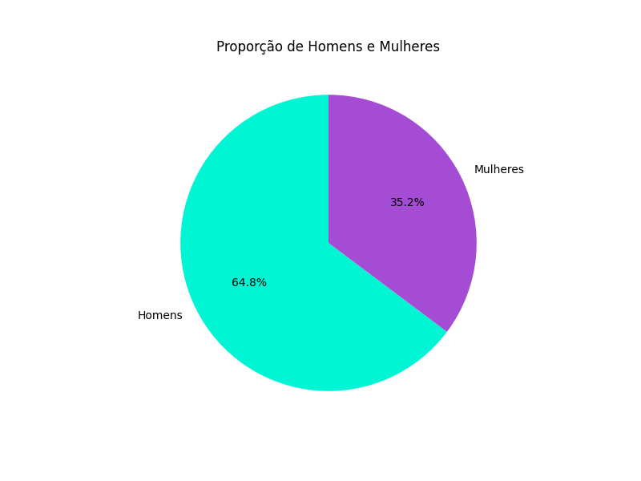
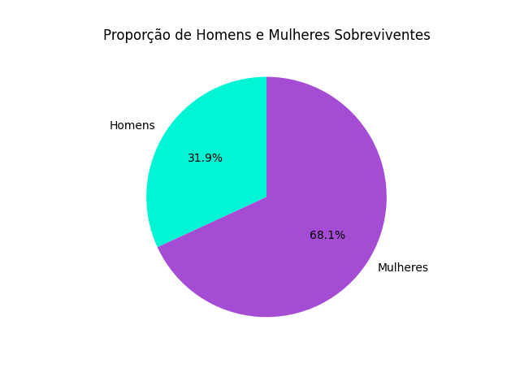

## Atividade Prática do Curso Introdução ao Data Science

# Análise Exploratória de Dados
### Sobre base de dados do Titanic

O presente projeto é uma análise da lista de pessoas passageiras do navio Titanic em sua famosa viagem inaugural. O objetivo é realizar uma análise exploratória dos dados para entender as características das pessoas passageiras e suas taxas de sobrevivência, como parte da atividade prática do curso de Introdução ao Data Science oferecido pelo Lab365 como parte do programa SCTEC.

## Bibliotecas utilizadas

Este projeto foi desenvolvido utilizando um ambiente virtual para controle das bibliotecas. As bibliotecas utilizadas foram:
- Pandas: para manipulação e análise do dataset.
- NumPy: para operações numéricas.
- Matplotlib: para visualização dos dados em gráficos.

## Preparação dos dados

Foi verificada a presença de linhas duplicadas no conjunto de dados para remoção caso necessário.

Foi feita também uma verificação de valores nulos. Apenas as colunas Age, Cabin e Embarked apresentam valores nulos. A coluna Age possui 177 valores nulos, a coluna Cabin possui 687 valores nulos e a coluna Embarked possui 2 valores nulos. Como nenhuma dessas colunas foi utilizada na presente análise, os respectivos registros foram mantidos no dataset.

## Relatório de Análise

A análise exploratória dos dados do Titanic revelou informações sobre as características das pessoas passageiras e suas taxas de sobrevivência. A seguir, estão os principais pontos observados:

O navio tinha 891 pessoas passageiras, das quais 342 sobreviveram e 549 não sobreviveram. A taxa de sobrevivência geral foi de aproximadamente 38%.

Entre as pessoas passageiras, 577 (65%) eram homens e 314 (35%) eram mulheres.

A taxa de sobrevivência para as mulheres foi significativamente maior do que para os homens, com aproximadamente 74% das mulheres sobrevivendo, em comparação com apenas 19% dos homens.

Os gráficos abaixo permitem compararmos a quantidade total de homens e mulheres no navio com a quantidade de homens e mulheres que sobreviveram, o que corrobora aquela ideia de "mulheres e crianças primeiro" popularizada pela ficção:

