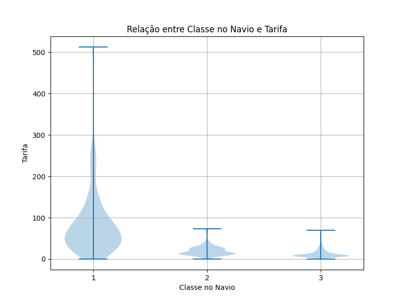
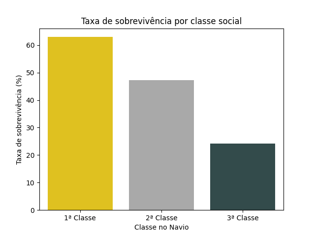

## Atividade Prática do Curso Introdução ao Data Science

# Análise Exploratória de Dados - Titanic

O presente projeto é uma análise da lista de pessoas passageiras do navio Titanic em sua famosa viagem inaugural. O objetivo é realizar uma análise exploratória dos dados para entender as características das pessoas passageiras e suas taxas de sobrevivência, como parte da atividade prática do curso de Introdução ao Data Science oferecido pelo Lab365 no contexto do programa SCTEC.

## Bibliotecas utilizadas

Este projeto foi desenvolvido utilizando um ambiente virtual para controle das bibliotecas. As bibliotecas utilizadas foram:
- Pandas: para manipulação e análise do dataset.
- Matplotlib: para visualização dos dados em gráficos.
- Seaborn: para visualização dos dados em gráficos.

## Preparação dos dados

Foi verificada a possibilidade de linhas duplicadas no conjunto de dados para remoção caso necessário.

Foi feita também uma verificação de valores nulos. Apenas as colunas _Age_, _Cabin_ e _Embarked_ apresentam valores nulos. A coluna _Age_ possui 177 valores nulos, a coluna _Cabin_ possui 687 valores nulos e a coluna _Embarked_ possui 2 valores nulos. Como nenhuma dessas colunas foi utilizada na presente análise, os respectivos registros foram mantidos no dataset.

## Relatório de Análise

A análise dos dados do Titanic revelou informações sobre as características das pessoas passageiras e suas taxas de sobrevivência. A seguir, estão os principais pontos observados:

### Gênero e sobrevivência

O navio tinha 891 pessoas passageiras, das quais 342 sobreviveram e 549 não sobreviveram. A taxa de sobrevivência geral foi de aproximadamente 38%.

Entre as pessoas passageiras, 577 (65%) eram homens e 314 (35%) eram mulheres.

A taxa de sobrevivência para as mulheres foi significativamente maior do que para os homens, com aproximadamente 74% das mulheres sobrevivendo, em comparação com apenas 19% dos homens.

Os gráficos abaixo permitem compararmos a quantidade total de homens e mulheres no navio com a quantidade de homens e mulheres que sobreviveram, o que corrobora aquela ideia de "mulheres e crianças primeiro" popularizada pela ficção:

### Classe no navio e tarifa

Foi observada a relação entre a classe no navio e a tarifa paga pela pessoa passageiro através de um gráfico de violino. O Titanic tinha três classes: primeira, segunda e terceira classe. A tarifa média paga pelas pessoas viajantes da primeira classe foi significativamente mais alta do que a tarifa média paga pelas pessoas viajantes da segunda e terceira classes. A tarifa média da primeira classe foi de aproximadamente 84 dólares, enquanto a tarifa média da segunda classe foi de cerca de 20 dólares e a da terceira classe de 13 dólares.

A motivação aqui foi de utilizar a classe no navio como um proxy para o status socioeconômico dos passageiros diante da suspeita que a classe social teve impacto na sobrevivência da pessoa passageira, verificada a seguir.

### Classe social e sobrevivência

A análise da relação entre a classe social e a sobrevivência revelou que as pessoas passageiras da primeira classe tiveram uma taxa de sobrevivência significativamente maior do que as da segunda e terceira classes. Aproximadamente 63% das pessoas que estavam na primeira classe sobreviveram, em comparação com cerca de 47% das pessoas na segunda classe e apenas 24% das na terceira classe, como mostrado no gráfico de barras abaixo. Esses resultados apontam que a classe social teve um impacto na probabilidade de sobrevivência das pessoas passageiras do Titanic.

